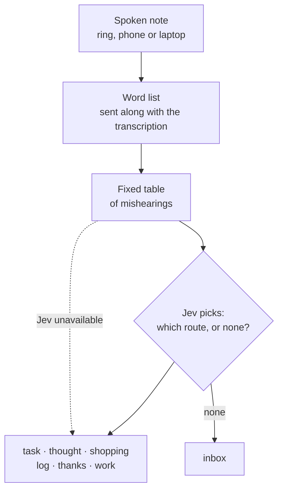

## The problem

Michael wears a Pebble Index 01: a ring you speak a short note into. The first word decides where it goes: "taak" (task) becomes a task, "gedachte" (thought) a journal note, "boodschap" (shopping) a line on the shopping list. But speech recognition doesn't always hear right. "Taak" becomes "paak", and the note lands in the wrong place. A word list of known mishearings caught some of that, but it only learned about a mistake after it had gone wrong once. **One in five notes went wrong.**

## The solution

On 15 September TypeSafe released Jev: a small model that doesn't write text, but picks from a fixed list of options and returns a probability. Three days later it was in the ring. The question to Jev is simple: *which of these seven routes is this, or none?*



*The full diagram (in Dutch), with every way to dictate and how the system learns each week: [[spraaknotities-jev.png|view full size]].*

## What it gets you

On 59 hand-checked sentences:

| | Right | Wrong |
|---|---|---|
| Word list alone | 47 of 59 | 20% |
| With Jev added | 58 of 59 | 2% |

And it's fast and dirt cheap. An answer typically arrives in **250 milliseconds**, and that one request carries two questions at once: where does this belong, and is there a misheard technical term in it? All 59 test calls together cost **$0.0021**. A thousand spoken notes cost a few cents.

The code stays in charge; the model answers one precise question. Because Jev only picks from what the code offers, it can't make anything up: at worst it picks wrong, and that you can measure. If Jev is unavailable, the old list decides again, so the system never stalls. A small, fast model like this doesn't need to be smarter than the big ones. It needs to sit in the right place.

## Try it yourself

Got a script that sorts free text by keywords (speech, email, forms)? Give this prompt to your AI assistant:

```text
My script routes text based on a list of keywords and variants. Build a
test: collect 50 real examples, label each with the correct route, and
measure how many my current list gets right. Then ask a small
classification model the same thing as a multiple-choice question: give
the routes as fixed options plus "none", and let the model only choose.
Keep the old list as a fallback. Compare accuracy, speed and cost per call.
```
