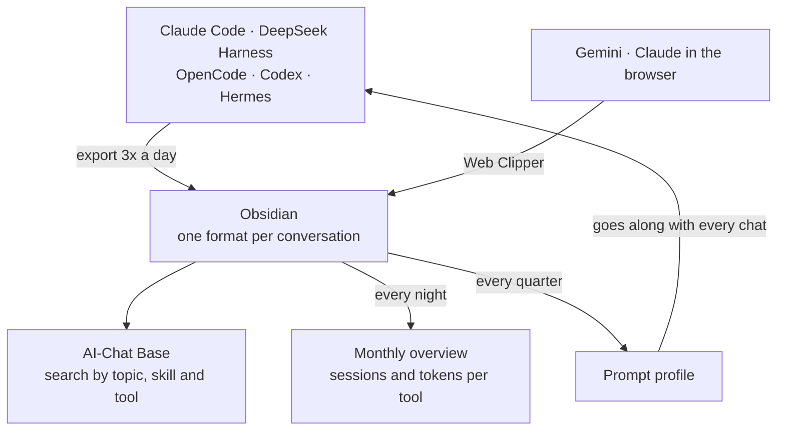
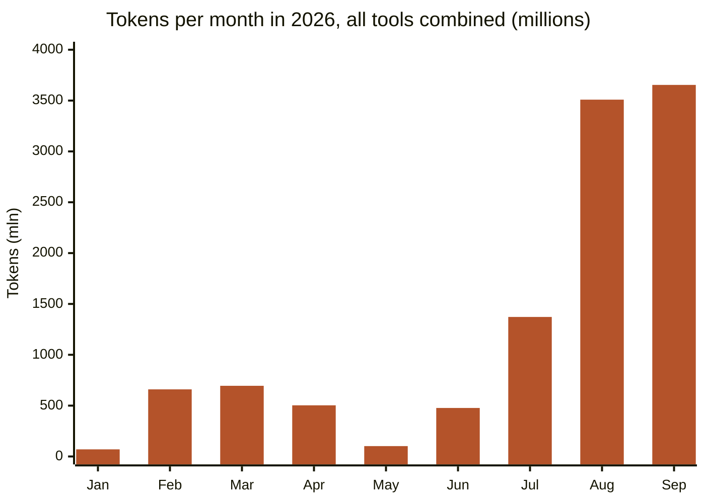

## The problem

Michael works with many AI tools at once: Claude Code, DeepSeek Harness, OpenCode, Codex, Hermes (a personal assistant), and Gemini and Claude in the browser. Each keeps its conversations in its own place, in its own format. Something worked out a month ago is hard to find again.

## The solution

Every conversation becomes a Markdown note in Obsidian, with the same frontmatter: date, source, model, tokens and `categories: [[AI-Chat]]`. On top of that, two fields that make searching easy: **links to the skills** used in the conversation, and the **topics** discussed, each in its own column.

- **Coding tools:** a script exports the sessions three times a day and has a small model write the summary and topics.
- **Browser conversations:** the Obsidian Web Clipper, Obsidian's browser extension, cuts the conversation out of the page and fills in title and summary with an AI prompt.
- **One overview:** an Obsidian Base, a table view across notes, shows everything tagged `AI-Chat`. You search and filter by title, topic, skill or tool.
- **A monthly overview:** every night a script counts, per month and per tool, how many sessions there were and how many tokens they used, and puts that in a single note.



## What it gets you

On 30 September there are **1,421 conversations** in one Base. That gives context that would otherwise be scattered: which skill helped with which topic, and what has been tried before. The monthly overview shows **which tools are used most** and **how many tokens** they cost. In September DeepSeek Harness had the most sessions (196), and Claude Code by far the most tokens.



*Tokens as the exporters record them, including cached context: a measure of use, not a bill.*


And the conversations keep the [[en/posts/prompt-profile-let-the-ai-answer-at-your-level|prompt profile]] up to date. Every quarter a script looks at the conversations of the past months: where Michael talks about something often and in depth, and learns from it, the level goes up. That way the profile adapts without Michael having to maintain it.

The lesson: one agreed format is worth more than the smartest search.

## What doesn't work yet

- **Clipping is manual work.** Only 61 of the 1,421 conversations came in through the browser, so the profile leans heavily on the coding tools. And only 22 of those 61 have topics; the rest you find by title only.

## Try it yourself

Give this prompt to your own AI assistant:

```text
I use Obsidian and want all my AI conversations in one place. Write a
script that exports the conversations from [my AI tool] to Markdown, with
frontmatter: date, source, model, tokens, topics and categories:
"[[AI-Chat]]". Then create an Obsidian Base that shows every note in that
category, with one view per source. Also write a script that adds up the
number of conversations and tokens per month and per source in a note.
Finally, suggest a Web Clipper template for browser conversations, using
the same format.
```
