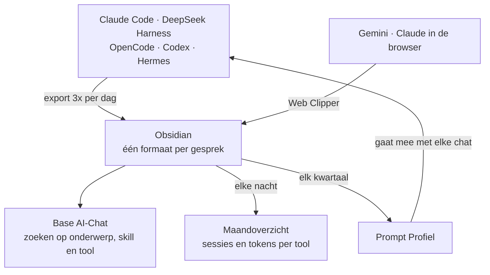
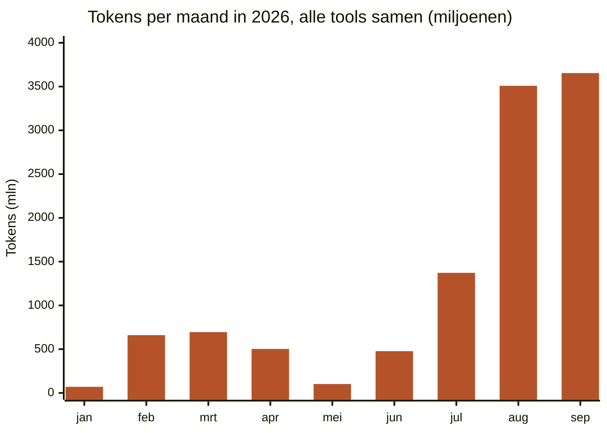

## Het probleem

Michael werkt met veel AI-tools tegelijk: Claude Code, DeepSeek Harness, OpenCode, Codex, Hermes (een eigen assistent), en in de browser Gemini en Claude. Elk bewaart gesprekken op een eigen plek, in een eigen formaat. Wat een maand geleden is uitgezocht, is daardoor lastig terug te vinden.

## De oplossing

Elk gesprek wordt een Markdown-notitie in Obsidian, met dezelfde frontmatter: datum, bron, model, tokens en `categories: [[AI-Chat]]`. Daarnaast twee velden die het zoeken makkelijk maken: **links naar de skills** die in het gesprek zijn gebruikt, en de besproken **onderwerpen**, elk in een eigen kolom.

- **Codeertools:** een script exporteert drie keer per dag de sessies en laat een klein model de samenvatting en onderwerpen schrijven.
- **Browsergesprekken:** de Obsidian Web Clipper knipt het gesprek uit de pagina en vult titel en samenvatting in met een AI-prompt.
- **Eén overzicht:** een Obsidian Base, een tabelweergave over notities, toont alles met `AI-Chat`. Je zoekt en filtert op titel, onderwerp, skill of tool.
- **Een maandoverzicht:** een script telt elke nacht per maand en per tool hoeveel sessies er waren en hoeveel tokens ze verbruikten, en zet dat in één notitie.



## Wat het oplevert

Op 30 september staan er **1.421 gesprekken** in één Base. Dat geeft context die anders verspreid zou liggen: bij welk onderwerp welke skill hielp, en wat er eerder al is geprobeerd. Het maandoverzicht laat zien **welke tools het meest gebruikt worden** en **hoeveel tokens** ze kosten. In september had DeepSeek Harness de meeste sessies (196), en Claude Code veruit de meeste tokens.



*Tokens zoals de exporters ze vastleggen, inclusief gecachte context: een maat voor gebruik, geen rekening.*


En de gesprekken houden het [[nl/posts/prompt-profiel-laat-de-ai-op-jouw-niveau-antwoorden|Prompt Profiel]] actueel. Elk kwartaal kijkt een script naar de gesprekken van de afgelopen maanden: waar Michael vaak en diepgaand over praat en van bijleert, gaat het niveau omhoog. Zo past het profiel zich aan zonder dat Michael het zelf hoeft bij te houden.

De les: één afgesproken formaat is meer waard dan de slimste zoekfunctie.

## Wat nog niet werkt

- **Clippen is handwerk.** Maar 61 van de 1.421 gesprekken kwamen via de browser binnen, dus het profiel leunt zwaar op de codeertools. En van die 61 hebben er maar 22 onderwerpen; de rest vind je alleen op titel.

## Zelf proberen

Geef deze prompt aan je eigen AI-assistent:

```text
Ik gebruik Obsidian en wil al mijn AI-gesprekken op één plek. Schrijf een
script dat de gesprekken van [mijn AI-tool] exporteert naar Markdown, met
frontmatter: datum, bron, model, tokens, onderwerpen en categories:
"[[AI-Chat]]". Maak daarna een Obsidian Base die alle notities met die
categorie toont, met één weergave per bron. Schrijf ook een script dat
per maand en per bron het aantal gesprekken en de tokens optelt in een
notitie. Stel tot slot een Web Clipper-sjabloon voor voor gesprekken in
de browser, met hetzelfde formaat.
```
