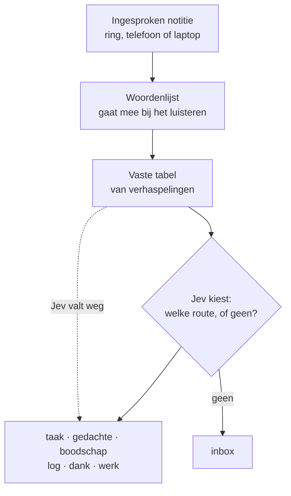

## Het probleem

Michael draagt een Pebble Index 01: een ring waarin je een korte notitie inspreekt. Het eerste woord bepaalt waar die heen gaat: "taak" wordt een taak, "gedachte" een journal-notitie, "boodschap" een regel op de boodschappenlijst. Maar spraakherkenning hoort niet altijd goed. "Taak" wordt "paak", en de notitie belandt op de verkeerde plek. Een woordenlijst met bekende verhaspelingen ving dat deels op, maar kende elke fout pas nadat hij een keer was misgegaan. **Eén op de vijf notities ging fout.**

## De oplossing

Op 15 september bracht TypeSafe Jev uit: een klein model dat geen tekst schrijft, maar uit een vaste lijst opties kiest en er een kans bij geeft. Drie dagen later zat het in de ring. De vraag aan Jev is simpel: *welke van deze zeven routes is dit, of geen?*



*Het volledige schema, met alle manieren van inspreken en hoe het systeem elke week bijleert: [[spraaknotities-jev.png|bekijk op volle grootte]].*

## Wat het oplevert

Op 59 met de hand nagekeken zinnen:

| | Goed | Fout |
|---|---|---|
| Alleen de woordenlijst | 47 van 59 | 20% |
| Met Jev erbij | 58 van 59 | 2% |

En het is snel en spotgoedkoop. Een antwoord komt doorgaans binnen **250 milliseconden**, en in dat ene verzoek zitten twee vragen tegelijk: waar hoort dit bij, en staat er een verhaspelde vakterm in? Alle 59 testaanroepen samen kostten **$0,0021**. Duizend ingesproken notities kosten dus een paar cent.

De code houdt de regie, het model beantwoordt één precieze vraag. Omdat Jev alleen kiest uit wat de code aanbiedt, kan het niets verzinnen: hooguit verkeerd kiezen, en dat is meetbaar. Valt Jev weg, dan beslist de oude lijst weer, dus stilvallen doet het systeem nooit. Zo'n klein, snel model hoeft niet slimmer te zijn dan de grote. Het moet op de juiste plek zitten.

## Zelf proberen

Heb je een script dat vrije tekst op trefwoorden sorteert (spraak, e-mail, formulieren)? Geef deze prompt aan je AI-assistent:

```text
Mijn script routeert tekst op basis van een lijst trefwoorden en varianten.
Bouw een test: verzamel 50 echte voorbeelden, label ze met de juiste route,
en meet hoeveel mijn huidige lijst goed doet. Stel daarna dezelfde vraag
aan een klein classificatiemodel als meerkeuzevraag: geef de routes als
vaste opties plus "geen", en laat het model alleen kiezen. Houd de oude
lijst als terugval. Vergelijk score, snelheid en kosten per aanroep.
```
